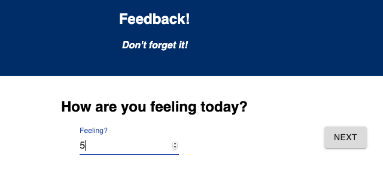
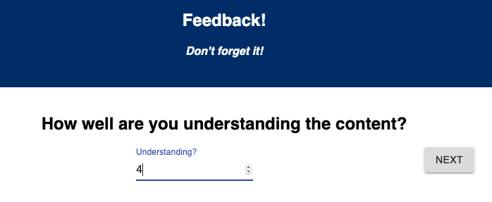
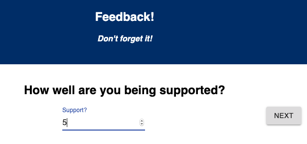
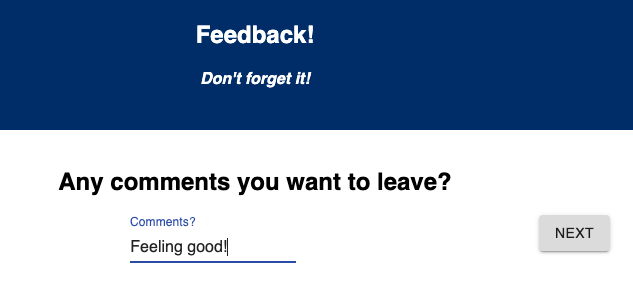
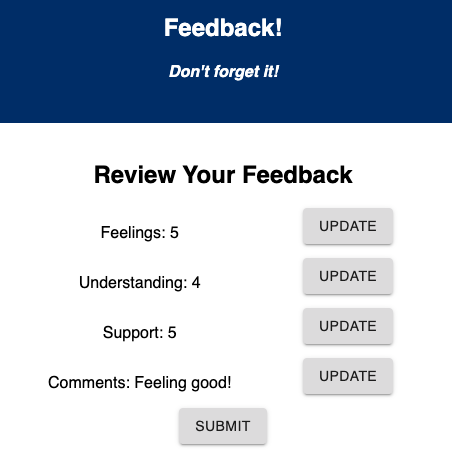
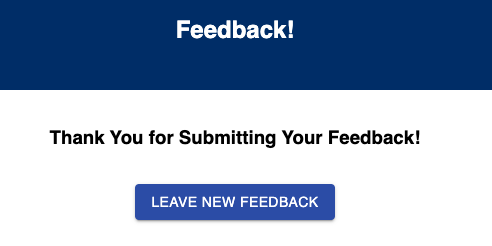
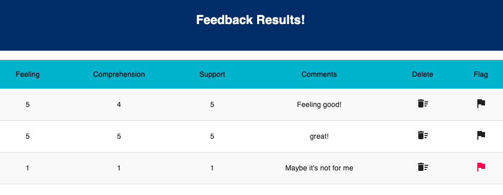

# Weekend Challenge: Redux Feedback Loop

[Here](./INSTRUCTIONS.md) are the project instructions.

## Description

For this challenge, I created a feedback form. There are four views for the form part: feeling, understanding, support and comments. For the first three parts of the form, an user inputs a number from 1 to 5. These steps also require an input in order to advance to the next step. However, the comments part of the form is an optional input field.

After the user completes the form, the user will be able to review their feedback and updates their feedbacks (by clicking the UPDATE button next to the input on the review page). Once the user finished their review, the user can clicked on the SUBMIT button to submit their feedback to be saved in the database. The user will see a submission success page with a "Leave New Feedback" button which takes the user to the first page of the feedback form to start a new feedback.

There is also an admin view for this application. An admin can visit the route `/admin` to see an admin view which displays all of the existing feedback saved in the database. The most recent feedback appears at the top of the list. The admin can delete or flag an existing feedback by clicking on the appropriate icon. When an admin click on the delete icon, a confirmation is required prior to delete the feedback. When an admin click on the flag icon, the icon will turn red to indicate that further review is required. Once the review is done, the admin can click on the flag icon to turn it back to black.

## Screen Shot

- How are you feeling today?  
  
- How well are you understanding the content?  
  
- How well are you being supported?  
  
- Any comments you want to leave?  
  
- Review your feedback  
  
- Thank you for submitting your feedback!  
  
- Admin view  
  

### Prerequisites

- [Node.js](https://nodejs.org/en/)
- [Postgresql](https://www.postgresql.org/download/)
- [Postico](https://eggerapps.at/postico/)

## Installation

1. Create a database named `prime_feedback`,
2. The queries in the `data.sql` file are set up to create all the necessary tables and sample data to allow the application to run correctly. The project is built on [Postgres](https://www.postgresql.org/download/), so you will need to make sure to have that installed. We recommend using Postico to run those queries as that was used to create the queries,
3. Open up your editor of choice and run an `npm install`
4. Run `npm run server` in your terminal
5. Run `npm run client` in your terminal
6. The `npm run client` command will open up a new browser tab for you!

## Built With

javascript, node, express, body-parser, pg, SQL, Postman, Postico, Postgres, axios, react, react router, redux, material-UI

## Acknowledgement

Thanks to [Prime Digital Academy](www.primeacademy.io) who equipped and helped me to make this application a reality.

## Support

If you have suggestions or issues, please email me at [beileiwang@gmail.com](beileiwang@gmail.com).
